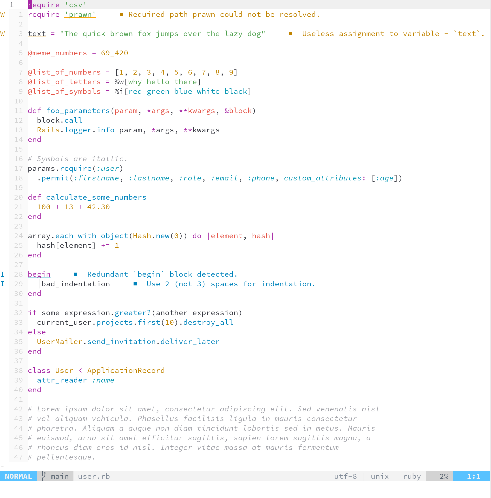

One half for neovim
===

A light colorscheme for neovim.



This theme is based on the [One half](https://github.com/sonph/onehalf) color scheme. I have made some slight modifications to suit my personal preferences. I mainly program in Ruby, so the styling will be adjusted to make Ruby syntax look good.

The plugin was created with the aid of [Lush](https://github.com/rktjmp/lush.nvim).

Make sure you have neovim 0.5 with treesitter installed.

Install the colorscheme with your favorite plugin manager.

Install with Plug in vimscript.

```vimscript
call plug#begin('~/.vim/plugged')
" Colorschemes
Plug 'rktjmp/lush.nvim'
Plug 'CodeGradox/onehalf-lush'
call plug#end()

# Set the color scheme.
set termguicolors
set background=light
colorscheme onehalf-light
```

And here is how you do it with Packer in Lua.

```lua
return require("packer").startup(function()
  -- Colorschemes
  use "rktjmp/lush.nvim"
  use "CodeGradox/onehalf-lush"
end)

# Set the color scheme.
vim.opt.background = "light"
vim.cmd [[colorscheme onehalf-lush]]
```

You can enable better syntax highlight with the following line.

```vimscript
lua <<EOF
require'nvim-treesitter.configs'.setup {
  highlight = {
    enable = true,
    additional_vim_regex_highlighting = false,
  },
}
EOF
```
